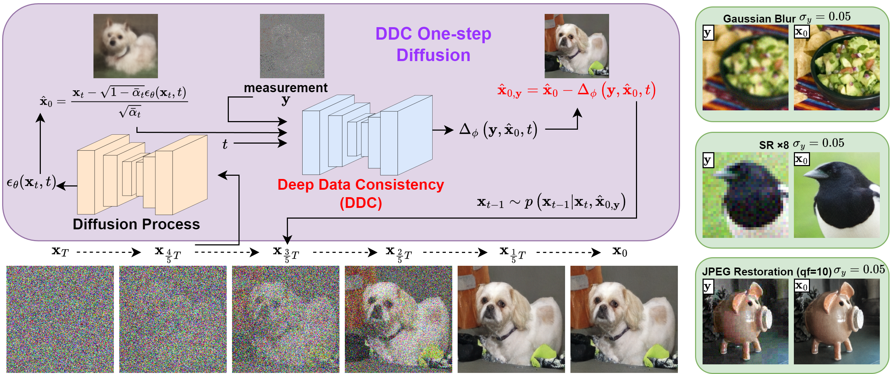

# Deep Data Consistency: a Fast and Robust Diffusion Model-based Solver for Inverse Problems

This repository contains the official implementation of our paper **DDC**: "[Deep Data Consistency: a Fast and Robust Diffusion Model-based Solver for Inverse Problems](https://arxiv.org/abs/2405.10748)". It provides an overview of the project, instructions for installation and usage, and other information.

## Overview

We introduce a *deep-learning-based data consistency update approach to solve inverse problems with diffusion models*, which demonstrates **high quality, rapidity, and robustness** in comparison with state-of-the-art methods on different datasets. **Only 5 inference steps are required.**

Specifically, a neural network is used to update the data consistency step as follows:

$`\hat{\mathbf{x}}_{0, \mathbf{y}} = \hat{\mathbf{x}}_0 - \Delta_{\phi} \left(\mathbf{y}, \hat{\mathbf{x}}_0, t \right)`$

where $\hat{\mathbf{x}}_0$ is predicted by pre-trained diffusion network. DDC network ${\phi}$ is a U-Net and is trained by a variational bound training objective:

$`L_{\phi} = \underbrace{- \mathbb{E}_{\mathbf{x}_0, t, \mathbf{x}_t, \mathbf{y}} \left [\log p(\hat{\mathbf{x}}_{0, \mathbf{y}} | \mathbf{x}_t , \mathbf{y}) \right ]}_{L_{recon}} + \underbrace{\mathbb{E}_{\mathbf{x}_0, t, \mathbf{x}_t, \mathbf{y}}D_{KL} (q(\mathbf{x}_t | \mathbf{x}_0 , \mathbf{y}) \Vert p(\mathbf{x}_t | \mathbf{y}))}_{L_{KL}}.`$

More details are provided in the [paper](https://arxiv.org/abs/2405.10748).

## Installation

### (1) Clone

    git clone https://github.com/Hanyu-Chen373/DeepDataConsistency.git
    cd DeepDataConsistency

### (2) Environment

Create new environment *ddc* and install dependencies.

    conda create -n ddc python=3.8
    conda activate ddc
    conda install pytorch==1.13.1 torchvision==0.14.1 torchaudio==0.13.1 pytorch-cuda=11.7 -c pytorch -c nvidia
    conda install pyyaml tensorboard tqdm scipy diffusers matplotlib
    pip install lpips safetensors opencv-python datasets scikit-image==0.19

### (3) Pre-trained models
Two kinds of models are required to implent the project: diffusion model and DDC model.
#### Diffusion models
Diffusion models are taken from existing pre-trained models on [ImageNet](https://image-net.org/) and [CelebA](http://mmlab.ie.cuhk.edu.hk/projects/CelebA.html) dataset. The diffusion model link is as follows:
- [256x256_diffusion_uncond.pt](https://openaipublic.blob.core.windows.net/diffusion/jul-2021/256x256_diffusion_uncond.pt): trained on ImageNet by [guided-diffusion](https://github.com/openai/guided-diffusion), and should be placed at `/exp/logs/imagenet/256x256_diffusion_uncond.pt`.
- [celeba_hq.ckpt](https://drive.google.com/file/d/1wSoA5fm_d6JBZk4RZ1SzWLMgev4WqH21/view): trained on CelebA by [RePaint](https://github.com/andreas128/RePaint), and should be placed at `/exp/logs/celeba/celeba_hq.ckpt`.

#### DDC models
The DDC model is trained by us. We provide 2 kinds of DDC model, and both of them can are pretrained to be able to solve 5 inverse problems (SR4, SR8, Gaussian blur, 92% random inpainting, and JPEG-10) with a Gaussian noise strength 0 to 0.05. Here are the download links:
- [Standard](https://drive.google.com/file/d/1ngXz-_zXdWGAy3aERCCY_-zq4dhVuVY0/view?usp=drive_link)
- [WoLPIPS](https://drive.google.com/file/d/1H1wTxSUFtLcLwLBTe3BZlPNvBQsJWsFg/view?usp=drive_link) (trained without LPIPS loss)

You can also train your own task-specific models as the simple training commands below. The pre-trained DDC model should be placed at `/exp/logs/ddc_network/` includes `diffusion_pytorch_model.safetensors` and `config.json`.

## DDC Sampling
### Quick Start
Once the dependencies, diffusion model, and DDC model are well prepared, we can solve the inverse problems. Here is a simple command to run DDC.

    python main.py --ni --config imagenet_256.yml --path_y imagenet --deg "sr_bicubic" --deg_scale 4 --sigma_y 0.05 -i demo

### Parameters
Here we breifly explain the meanings of the main parameters.

- **config**: diffusion configurations. We provide `celeba_hq.yml` and `imagenet_256.yml` for the two models. Inference steps can be set in this file.
- **path_y**: the folder that contains the validation images. The folder is `/exp/datasets/{path_y}`.
- **deg & deg_scale**: the inverse problem setting. We provide several choices including:
  - **sr_bicubic**: bicubic super-resolution task. `deg_scale` is downsampling factor, e.g. 4 or 8.
  - **gaussian_blur**: Gaussian deblur task. `deg_scale` is not required.
  - **inpaint_random**: random inpainting which masks pixels on all RGB channels. `deg_scale` is the mask proportion, e.g. 0.92.
  - **jpeg**: JPEG restoration task. `deg_scale` is the quality factor (QF), e.g. 10.
- **sigma_y**: the Gaussian noise added to the measurement $\mathbf{y}$.
- **i**: image folder to store the output. The folder is `/exp/image_samples/{i}`.
- **ni**: whether to overwrite existing results.

## DDC Training

Here is a simple command to train a DDC model.

    accelerate launch train_ddc.py --dataset_folder="mini_dataset" --output_dir="./DDC_training" --train_batch_size=2 --num_epochs=100 --gradient_accumulation_steps=4 --lr_warmup_steps=2000 --use_ema --checkpointing_steps=5000 --deg="sr_bicubic" --deg_scale=4 --sigma_y=0.05

### Parameters
- **dataset_folder**: the training dataset folder. We here offer a mini dataset `/mini_dataset` which only contains 50 images from ImageNet dataset. An example code to build a dataset folder from images is provided in `/create_dataset.ipynb`. Other datasets from *diffusers* package might be practical.
- **output_dir**: the folder to store the DDC U-Net parameters. In our project, we always use the model under `unet_ema` folder.
- **train_batch_size**: batch size.
- **deg & deg_scale**: the inverse problem setting. `random` is for the generalized model that learns several tasks at the same time. Other is also useful to learn a task-specific model, including `sr_bicubic`, `gaussian_blur`, `inpaint_random`, and `jpeg`.
- **sigma_y**: the Gaussian noise strength added to the measurement. *Importantly, here we default add the **noise strength randomly from 0 to sigma_y, rather than a constant strength sigma_y**.* Thus we obtain a model that can solve noisy inverse problems with a wide range of noise. You can also change the codes to train a noise-strength-specific model. 

## Reference
If you find our work useful, please consider citing following work:

    @article{chen2024deep,
      title={Deep Data Consistency: a Fast and Robust Diffusion Model-based Solver for Inverse Problems}, 
      author={Hanyu Chen and Zhixiu Hao and Liying Xiao},
      journal={arXiv preprint arXiv:2405.10748},
      year={2024}
    }

This project implementation is partly inspired by previous repositories:
- **DDNM:** https://github.com/wyhuai/DDNM
- **DPS:** https://github.com/DPS2022/diffusion-posterior-sampling
- **Diffusers:** https://github.com/huggingface/diffusers
